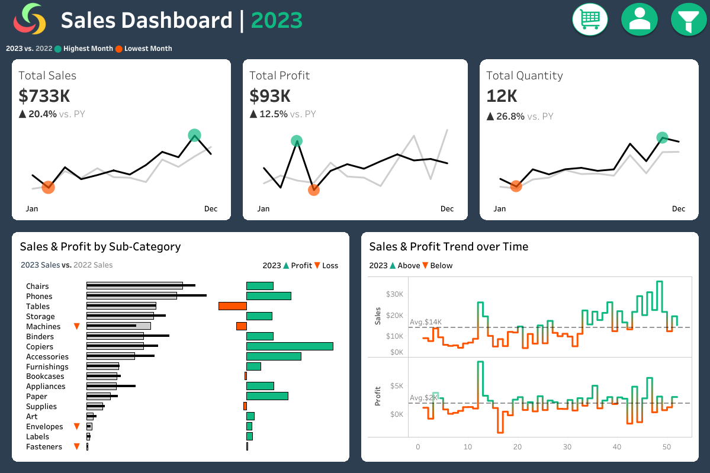
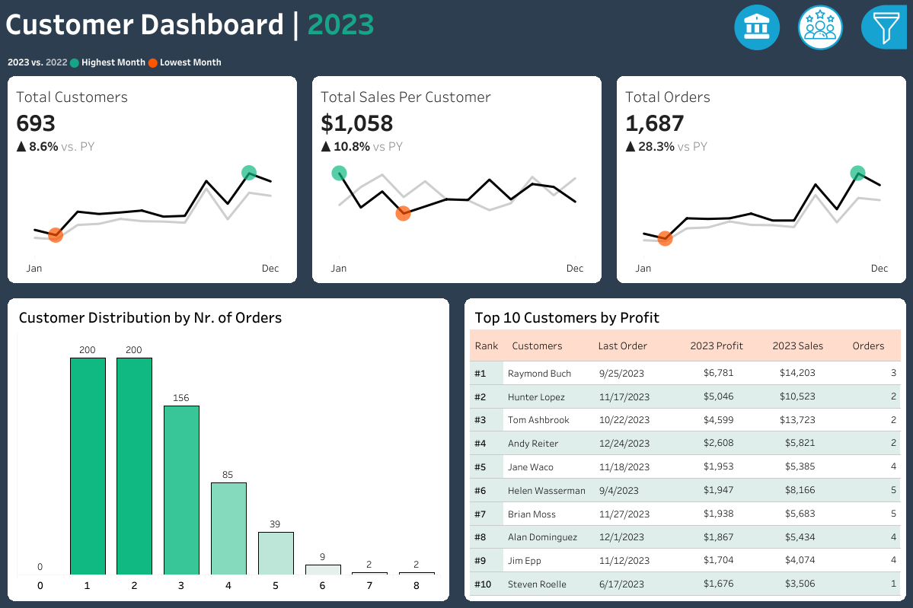

# Sales & Customer Performance Dashboards

> **Interactive Tableau dashboards for analyzing sales performance, customer behavior, and year-over-year business trends.**

[](https://www.tableau.com/)
[]()
[]()

---

## 📊 Project Overview

This project focuses on building an interactive **Sales & Customer Performance Analytics solution in Tableau** for sales managers, executives, and business stakeholders.

The solution consists of two interconnected dashboards:

* **Sales Dashboard** — analyzes sales, profit, quantity, and sales trends.
* **Customer Dashboard** — analyzes customer growth, order behavior, customer value, and top-performing customers.

The dashboards were designed around a defined business user story and requirements, translating business questions into interactive Tableau visualizations and analytical metrics.

The primary analytical focus is **Year-over-Year (YoY) performance**, allowing stakeholders to compare the selected year against the previous year and identify important changes in business performance.

---

## 🎯 Business Problem

Sales and customer data can contain a large amount of information that is difficult to interpret through raw tables or static reports.

Business stakeholders need to quickly answer questions such as:

* How are sales performing compared with the previous year?
* Which months are driving or weakening sales performance?
* Which product subcategories are generating the most sales and profit?
* Which weeks are performing above or below the average?
* How is the customer base changing?
* How frequently are customers placing orders?
* Which customers are generating the highest profit?
* When did top customers last place an order?
* Can management easily investigate performance by category, subcategory, region, state, and city?

This project addresses these questions through an interactive Tableau BI solution.

---

# 🧩 User Story

> **Sales Performance**

The objective is to provide sales managers and executives with an interactive analytical solution that helps them evaluate sales performance, understand customer behavior, identify trends, and investigate business performance across different products and geographic locations.

---

# 📌 Dashboard Requirements

The dashboards were developed based on the following business requirements.

### Sales Dashboard

* Current-year and previous-year KPI comparison
* Monthly sales, profit, and quantity trends
* Identification of highest and lowest performing months
* Current-year vs previous-year subcategory comparison
* Sales and profit comparison by subcategory
* Weekly sales and profit analysis
* Weekly average performance
* Identification of weeks above and below average

### Customer Dashboard

* Current-year and previous-year customer KPIs
* Monthly customer, sales-per-customer, and order trends
* Identification of highest and lowest performing months
* Customer distribution based on number of orders
* Top 10 customers by profit
* Customer rank, orders, sales, profit, and last order date

### Interactivity

* Dynamic year selection
* Navigation between dashboards
* Interactive chart filtering
* Category and subcategory filtering
* Region, state, and city filtering
* Cross-dashboard analytical exploration

---

# 📈 Sales Dashboard

## Purpose

The Sales Dashboard provides an executive-level overview of sales performance while allowing users to investigate changes over time and across product subcategories.

### Key KPIs

The dashboard provides current-year and previous-year comparisons for:

* **Total Sales**
* **Total Profit**
* **Total Quantity**

These metrics provide a quick overview of business performance and make year-over-year changes easier to identify.

### Sales Trends

Monthly trends are provided for the major sales KPIs, allowing stakeholders to:

* Compare the selected year with the previous year
* Identify seasonal patterns
* Detect strong and weak months
* Identify peak and low-performing periods

### Product Subcategory Analysis

The dashboard compares product subcategories using:

* Sales
* Profit
* Current-year performance
* Previous-year performance

This allows users to identify subcategories that contribute strongly to revenue as well as those that generate stronger or weaker profitability.

### Weekly Sales & Profit Analysis

Weekly performance is analyzed for the selected year.

The dashboard includes:

* Weekly Sales
* Weekly Profit
* Average weekly performance
* Above-average weeks
* Below-average weeks

This provides a more granular view of short-term sales performance.

---

# 👥 Customer Dashboard

## Purpose

The Customer Dashboard provides an overview of customer growth, purchasing behavior, and customer value.

It helps stakeholders understand how the customer base is changing and identify high-value customers.

### Key KPIs

The dashboard provides current-year and previous-year comparisons for:

* **Total Customers**
* **Sales per Customer**
* **Total Orders**

These KPIs provide an overview of customer growth, customer value, and purchasing activity.

### Customer Trends

Monthly trends allow users to compare the selected year with the previous year and identify changes in:

* Customer count
* Sales per customer
* Order volume

This helps reveal changes in customer activity over time.

### Customer Distribution

Customers are distributed according to the number of orders they have placed.

This helps stakeholders understand:

* One-time customers
* Low-frequency customers
* Repeat customers
* Highly engaged customers

The distribution provides an initial view of customer purchasing behavior and engagement.

### Top 10 Customers by Profit

The dashboard identifies the **Top 10 customers by profit**.

Additional information includes:

* Customer rank
* Number of orders
* Current sales
* Current profit
* Last order date

This enables stakeholders to identify high-value customers and investigate their purchasing activity.

---

# 🎛️ Interactivity & User Experience

The dashboards were designed to support interactive business analysis rather than static reporting.

### Dynamic Year Selection

Users can select the year they want to analyze and compare it with the previous year.

This makes the dashboard reusable across multiple periods instead of being limited to a single reporting year.

### Interactive Filtering

Users can filter the analysis by:

* Category
* Subcategory
* Region
* State
* City

This allows stakeholders to move from a high-level overview to more specific business segments.

### Dashboard Navigation

Users can easily move between the:

**Sales Dashboard ↔ Customer Dashboard**

This creates a connected analytical experience rather than treating the dashboards as isolated reports.

### Chart Interactions

Visual elements can be used to filter and explore related information, allowing users to investigate areas of interest directly from the dashboard.

---

# 🧮 Tableau Techniques Used

This project demonstrates several Tableau capabilities beyond basic chart creation.

### Calculated Fields

Calculated fields were used to create analytical metrics such as:

* Current-year metrics
* Previous-year metrics
* Year-over-Year calculations
* Sales per customer
* Customer order metrics

### Table Calculations

Table calculations were used for analytical comparisons and ranking/aggregation logic, including:

* Window calculations
* Average calculations
* Ranking
* Index-based analysis

### Level of Detail Expressions

LOD calculations were used to derive customer-level metrics independently of the visualization's immediate level of detail.

### Parameters

Parameters were used to provide users with dynamic control over the analysis.

### Dashboard Actions

Interactive dashboard actions were implemented to connect visual elements and allow users to explore related information.

### Filters

Multiple filters were implemented to support product and geographic analysis.

---

# 🔍 Analytical Questions Answered

The dashboards allow stakeholders to investigate questions such as:

### Sales Performance

* How did sales perform compared with the previous year?
* Which months generated the highest sales?
* Which months experienced weaker performance?
* Which product subcategories are driving sales?
* Which subcategories generate stronger profit?
* Which weeks are performing above the average?
* Which weeks are performing below the average?

### Customer Performance

* Is the customer base growing?
* How does sales per customer compare with the previous year?
* How many orders are being generated?
* How frequently are customers ordering?
* How many customers are repeat customers?
* Which customers generate the highest profit?
* When did high-value customers last place an order?

### Business Segmentation

* Which categories and subcategories are performing well?
* How does performance vary across regions?
* Which states are contributing to performance?
* Which cities require further investigation?

---

# 💡 Key Analytical Value

The main value of this project is the transition from **static reporting to interactive business intelligence**.

Instead of simply displaying historical numbers, the dashboards allow users to:

**Monitor → Compare → Filter → Investigate**

For example:

> A stakeholder can identify a decline in monthly sales, select the affected period, investigate the relevant product subcategories, and then filter the analysis by geographic location.

This creates a more practical workflow for business performance analysis.

---

# 🛠️ Tools & Technologies

| Tool                          | Purpose                                      |
| ----------------------------- | -------------------------------------------- |
| **Tableau**                   | Dashboard development and data visualization |
| **Tableau Calculated Fields** | Business metrics and analytical calculations |
| **LOD Expressions**           | Customer-level analysis                      |
| **Table Calculations**        | Trends, averages, ranking, and comparisons   |
| **Parameters**                | Dynamic dashboard analysis                   |
| **Dashboard Actions**         | Interactive filtering and navigation         |
| **Filters**                   | Product and geographic segmentation          |

---

# 📷 Dashboard Preview

## Sales Dashboard



The Sales Dashboard provides an overview of sales, profit, quantity, monthly trends, subcategory performance, and weekly sales/profit performance.

---

## Customer Dashboard



The Customer Dashboard provides customer KPIs, customer trends, order-frequency distribution, and the Top 10 customers by profit.

---

# 🔗 Interactive Tableau Dashboard

The complete interactive version of the dashboard is available on Tableau Public:

**[View the Interactive Tableau Dashboard](https://public.tableau.com/views/SalesCustomerDashboards_17912317966810/SalesDashboard?:language=en-US&:sid=&:redirect=auth&:display_count=n&:origin=viz_share_link)**

---

# 📁 Repository Structure

```text
Sales-Customer-Dashboards
│
├── Dashboard
│   └── Sales & Customer Dashboards.twbx
│ 
└── Documentation
│   └── User-Story-Sales-Performance.md
│ 
├── Screenshots
│   ├── sales-dashboard.png
│   └── customer-dashboard.png
│ 
├── README.md
│ 
```

---

# 🚀 Skills Demonstrated

This project demonstrates practical skills in:

* Business Intelligence
* Tableau Dashboard Development
* Data Visualization
* KPI Design
* Year-over-Year Analysis
* Trend Analysis
* Customer Analytics
* Sales Analytics
* Profitability Analysis
* Product Subcategory Analysis
* Customer Segmentation
* Geographic Analysis
* Interactive Dashboard Design
* Calculated Fields
* Level of Detail Expressions
* Table Calculations
* Parameters
* Dashboard Actions
* Business Requirement Translation

---

# 📊 Project Level

**Level: Strong Intermediate Tableau / Business Intelligence Project**

This project goes beyond basic Tableau visualization by incorporating:

* Multiple dashboards
* Dynamic year analysis
* Current-year vs previous-year comparisons
* Calculated metrics
* LOD expressions
* Table calculations
* Interactive filtering
* Dashboard actions
* Customer-level analysis
* Product-level analysis
* Geographic filtering
* Executive-style KPI reporting

The project demonstrates the ability to translate a defined business requirement into an interactive BI solution.

---

# 🎯 Project Outcome

The final solution provides stakeholders with a centralized interactive environment for analyzing:

**Sales Performance + Product Performance + Customer Behavior**

Instead of relying on multiple static reports, stakeholders can interactively explore performance across different time periods, products, customers, and geographic locations.

The project demonstrates the practical application of Tableau for **business performance monitoring and exploratory analysis**.

---

# 🔮 Potential Future Enhancements

Possible future enhancements could include:

* Profit margin analysis
* Discount vs profitability analysis
* Customer retention and churn analysis
* Customer segmentation using RFM analysis
* Regional performance benchmarking
* Product profitability analysis
* Drill-down from executive KPIs to transaction-level details
* Forecasting
* Advanced anomaly detection
* Executive recommendations based on identified performance drivers

These enhancements would move the solution further toward **diagnostic and predictive analytics** rather than primarily descriptive and comparative reporting.

---

# 👤 Author

**Sharan Rathod**

Aspiring Data Analyst & BI Specialist focused on:

**SQL • Tableau • Power BI • Excel • Python • Business Intelligence**

---

## ⭐ Project Focus

> **Turning business requirements into interactive analytical dashboards that help stakeholders understand performance and make data-driven decisions.**
